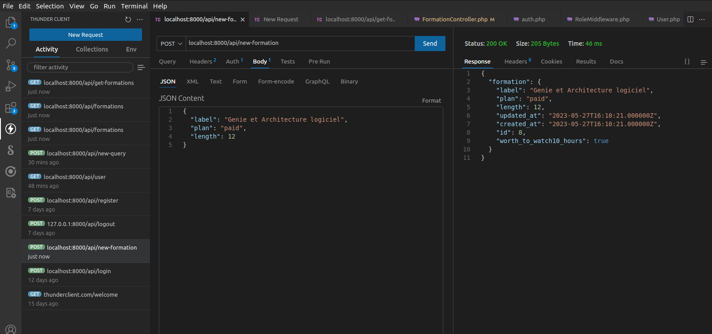
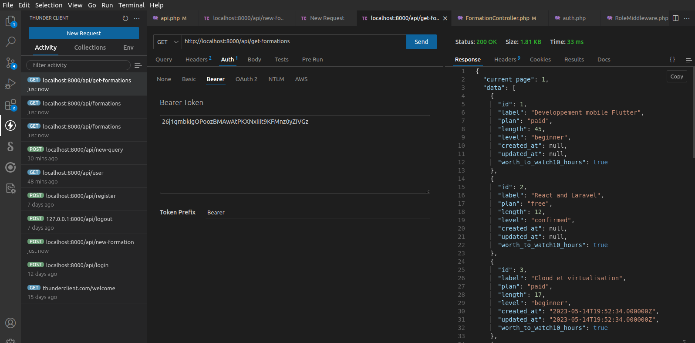
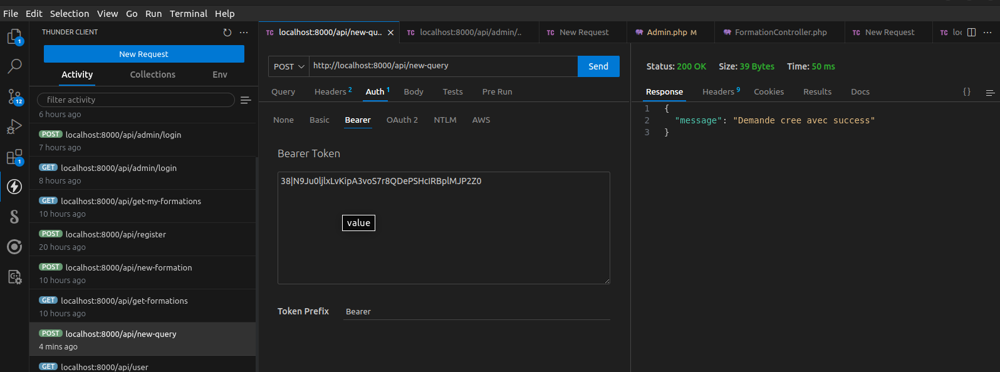
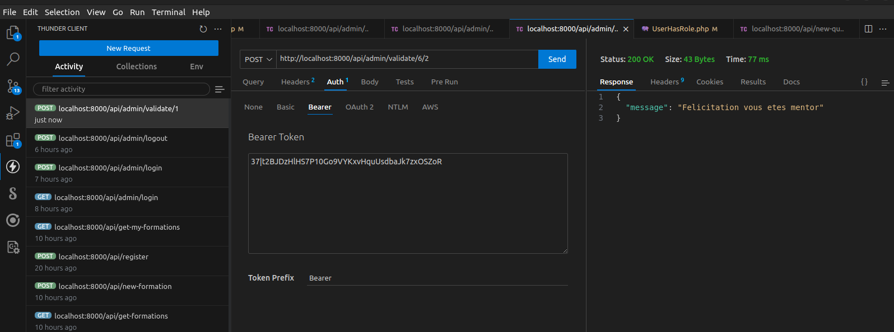
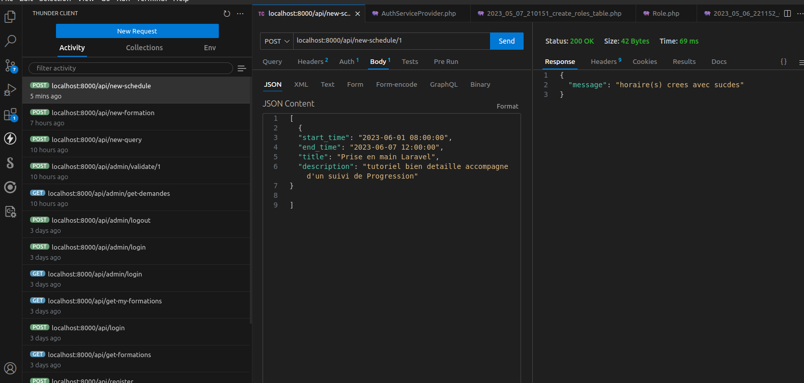

# apimentoring

### Route login avec les informations

## 

### Route register avec les informations

## http://127.0.0.1:8000/api/register

### Route ajouter une nouvelle formation _sans_ ajout obligatoire du _token Bearer pour_

## http://127.0.0.1:8000/api/new-formation

### Route pour recupere toutes les formations

## http://127.0.0.1:8000/api/get-formations

### Route pour se deconnecter _ajout_ du token dans l'onglet _Auth_

## http://127.0.0.1:8000/api/logout

### Route test Redeconnection refusee

## http://127.0.0.1:8000/api/logout

### Route pour ajouter une demande

## http://127.0.0.1:8000/api/new-query

### Route administrateur pour valider une demande

## http://127.0.0.1:8000/api/admin/validate/{user}/{demande}

### Route pour ajouter un ou plusieurs horaires de mentoring

## http://127.0.0.1:8000/api/new-schedule/{calendar}

