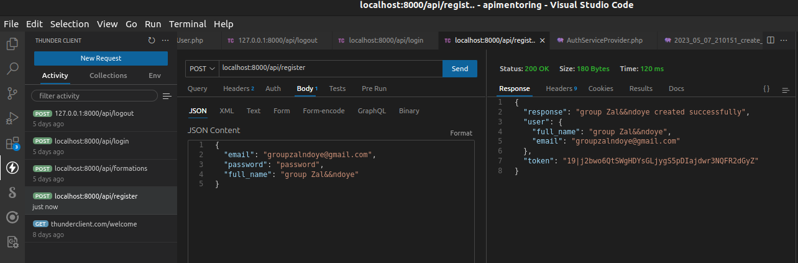
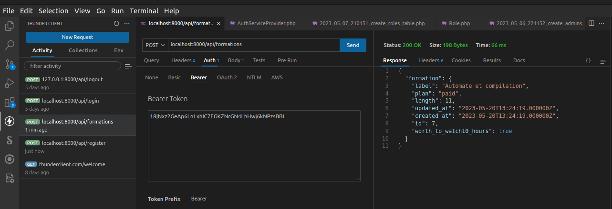
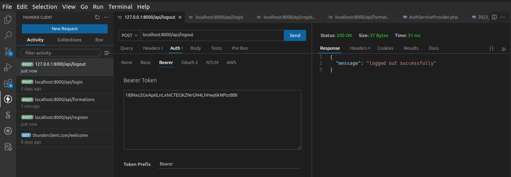
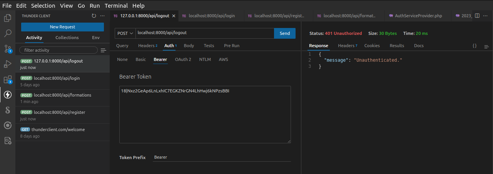

# apimentoring

### Route login avec les informations

### Route register avec les informations

### Route ajouter une nouvelle formation _sans_ ajout obligatoire du _token Bearer pour_

### Route ajouter une nouvelle formation _avec_ ajout du _token Bearer pour_

### Route pour se deconnecter _ajout_ du token dans l'onglet _Auth_

### Route test Redeconnection refusee

